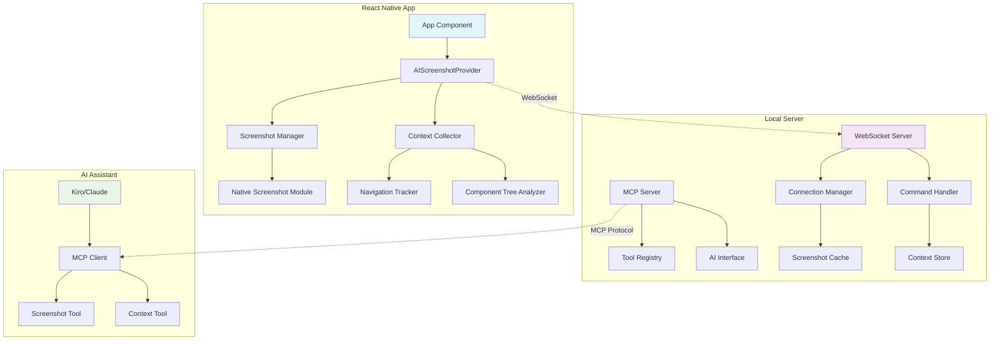
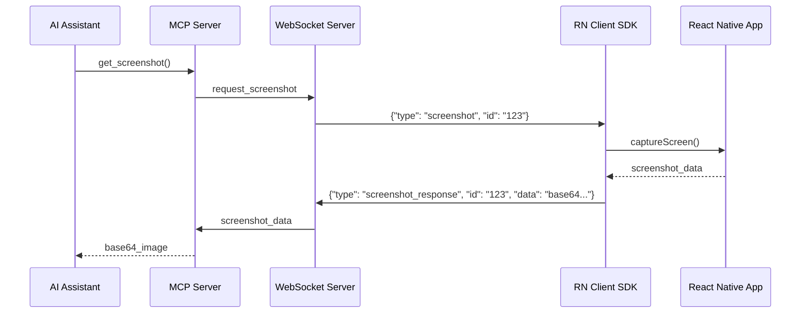
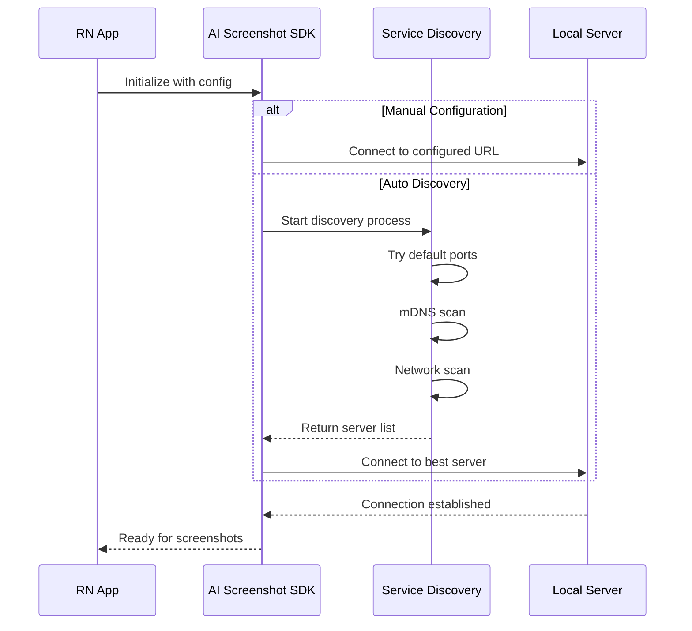

# Design Document

## Overview

React Native AI截图SDK是一个双端架构的开源解决方案，旨在让AI编程助手能够实时获取React Native应用的视觉状态。系统由客户端SDK和本地服务端组成，通过WebSocket进行实时通信，并通过MCP协议为AI提供标准化的工具接口。

### 核心价值
- **实时视觉反馈**：AI能够看到当前应用界面，提供更精准的代码建议
- **开发效率提升**：减少开发者描述UI状态的时间，让AI直接理解界面
- **隐私安全**：所有数据在本地处理，不上传到云端
- **易于集成**：最小化集成成本，开发者只需添加一个Provider即可

## Architecture

### 系统架构图



### 数据流图



## Service Discovery

### 服务端发现机制

为了解决客户端如何找到服务端的问题，我们提供多种发现机制：

#### 1. 直接配置接口（推荐）
```typescript
// 开发者在代码中直接配置
<AIScreenshotProvider 
  config={{
    serverUrl: 'ws://192.168.1.100:8080', // 明确指定
    // 或者
    serverHost: '192.168.1.100',
    serverPort: 8080,
    autoDiscovery: false // 禁用自动发现
  }}
>
  <App />
</AIScreenshotProvider>

// 或者使用自动发现
<AIScreenshotProvider 
  config={{
    autoDiscovery: true, // 启用自动发现
    discoveryTimeout: 5000, // 5秒超时
    fallbackUrl: 'ws://localhost:8080' // 发现失败时的备用地址
  }}
>
  <App />
</AIScreenshotProvider>
```

#### 2. 自动发现机制（默认启用）
```typescript
interface ServiceDiscovery {
  // mDNS/Bonjour服务发现
  discoverViaMDNS(): Promise<ServerInfo[]>;
  
  // 本地网络扫描
  scanLocalNetwork(portRange: number[]): Promise<ServerInfo[]>;
  
  // 默认端口尝试
  tryDefaultPorts(): Promise<ServerInfo | null>;
}

// 默认发现策略
const DEFAULT_DISCOVERY_STRATEGY = [
  'localhost:8080',  // 默认端口
  'localhost:3001',  // 常用开发端口
  'localhost:4000',  // 备用端口
  // mDNS发现
  // 本地网络扫描 (192.168.x.x:8080)
];
```

#### 3. CLI工具辅助
```bash
# 服务端启动时显示连接信息
npx rn-ai-screenshot-server start
# 输出：
# ✅ Server started at ws://192.168.1.100:8080
# 📱 Add this to your React Native app:
# 
# <AIScreenshotProvider config={{serverUrl: 'ws://192.168.1.100:8080'}}>
#   <App />
# </AIScreenshotProvider>
#
# 🔍 Or use auto-discovery (recommended):
# <AIScreenshotProvider config={{autoDiscovery: true}}>
#   <App />
# </AIScreenshotProvider>
```

#### 4. 开发者友好的配置方式
```typescript
// 支持多种配置方式，开发者可以选择最适合的
const configs = {
  // 1. 最简单 - 自动发现（推荐）
  simple: { autoDiscovery: true },
  
  // 2. 明确指定 - 适合固定环境
  explicit: { 
    serverUrl: 'ws://192.168.1.100:8080' 
  },
  
  // 3. 灵活配置 - 适合复杂场景
  flexible: {
    serverHost: '192.168.1.100',
    serverPort: 8080,
    autoDiscovery: true, // 主地址失败时自动发现
    discoveryTimeout: 3000,
    retryAttempts: 3
  }
};
```

#### 5. 二维码配置（移动端友好）
```typescript
// 服务端生成二维码
interface QRCodeConfig {
  serverUrl: string;
  version: string;
  capabilities: string[];
}

// 客户端扫码配置
interface QRCodeScanner {
  scanConfig(): Promise<QRCodeConfig>;
  applyConfig(config: QRCodeConfig): void;
}
```

### 连接建立流程



## Components and Interfaces

### 客户端SDK架构

#### 1. AIScreenshotProvider
```typescript
interface AIScreenshotProviderProps {
  config?: SDKConfig;
  children: React.ReactNode;
}

interface SDKConfig {
  // 服务器连接配置
  serverUrl?: string;           // 完整URL: 'ws://192.168.1.100:8080'
  serverHost?: string;          // 主机地址: '192.168.1.100'
  serverPort?: number;          // 端口: 8080
  
  // 自动发现配置
  autoDiscovery?: boolean;      // 启用自动发现 (默认: true)
  discoveryTimeout?: number;    // 发现超时时间 (默认: 5000ms)
  fallbackUrl?: string;         // 发现失败时的备用地址
  retryAttempts?: number;       // 连接重试次数 (默认: 3)
  
  // 功能配置
  enableInProduction?: boolean; // 生产环境启用 (默认: false)
  privacyMode?: boolean;        // 隐私模式 (默认: false)
  screenshotQuality?: number;   // 截图质量 0-1 (默认: 0.8)
  
  // 调试配置
  logLevel?: 'debug' | 'info' | 'warn' | 'error'; // 日志级别 (默认: 'warn')
  showConnectionStatus?: boolean; // 显示连接状态 (默认: true in dev)
}
```

#### 2. Screenshot Manager
```typescript
interface ScreenshotManager {
  captureScreen(): Promise<string>; // base64
  captureComponent(ref: ComponentRef): Promise<string>;
  setQuality(quality: number): void;
  enablePrivacyMode(enabled: boolean): void;
}
```

#### 3. Context Collector
```typescript
interface AppContext {
  currentRoute: string;
  routeParams: Record<string, any>;
  componentTree: ComponentNode[];
  userInteractions: InteractionEvent[];
  timestamp: number;
}

interface ComponentNode {
  type: string;
  props: Record<string, any>;
  children: ComponentNode[];
  position?: { x: number; y: number; width: number; height: number };
}
```

#### 4. WebSocket Client
```typescript
interface WebSocketClient {
  connect(url: string): Promise<void>;
  disconnect(): void;
  send(message: WSMessage): void;
  onMessage(callback: (message: WSMessage) => void): void;
  onError(callback: (error: Error) => void): void;
  onReconnect(callback: () => void): void;
  discoverServer(): Promise<ServerInfo>;
}

interface ServerInfo {
  host: string;
  port: number;
  version: string;
  capabilities: string[];
}

interface WSMessage {
  type: 'screenshot' | 'context' | 'command' | 'screenshot_response' | 'context_response' | 'discovery';
  id: string;
  data?: any;
  error?: string;
}
```

### 服务端架构

#### 1. WebSocket Server
```typescript
interface WebSocketServer {
  start(port: number): Promise<void>;
  stop(): void;
  broadcast(message: WSMessage): void;
  sendToClient(clientId: string, message: WSMessage): void;
  onClientConnect(callback: (clientId: string) => void): void;
  onClientDisconnect(callback: (clientId: string) => void): void;
  onMessage(callback: (clientId: string, message: WSMessage) => void): void;
}
```

#### 2. MCP Server
```typescript
interface MCPServer {
  start(): Promise<void>;
  registerTool(tool: MCPTool): void;
  handleRequest(request: MCPRequest): Promise<MCPResponse>;
}

interface MCPTool {
  name: string;
  description: string;
  inputSchema: JSONSchema;
  handler: (input: any) => Promise<any>;
}
```

#### 3. Screenshot Service
```typescript
interface ScreenshotService {
  requestScreenshot(clientId?: string): Promise<string>;
  cacheScreenshot(clientId: string, data: string): void;
  getLatestScreenshot(clientId: string): string | null;
  clearCache(): void;
}
```

#### 4. Context Service
```typescript
interface ContextService {
  requestContext(clientId?: string): Promise<AppContext>;
  updateContext(clientId: string, context: AppContext): void;
  getLatestContext(clientId: string): AppContext | null;
}
```

## Data Models

### 配置模型
```typescript
interface ServerConfig {
  websocket: {
    port: number;
    host: string;
    maxConnections: number;
    heartbeatInterval: number;
  };
  mcp: {
    port: number;
    tools: string[];
    timeout: number;
  };
  cache: {
    maxScreenshots: number;
    maxAge: number; // milliseconds
  };
  security: {
    allowedOrigins: string[];
    enableCORS: boolean;
  };
}
```

### 消息协议
```typescript
// WebSocket消息格式
interface WSMessage {
  type: MessageType;
  id: string;
  timestamp: number;
  data?: any;
  error?: {
    code: string;
    message: string;
    details?: any;
  };
}

enum MessageType {
  SCREENSHOT_REQUEST = 'screenshot_request',
  SCREENSHOT_RESPONSE = 'screenshot_response',
  CONTEXT_REQUEST = 'context_request',
  CONTEXT_RESPONSE = 'context_response',
  COMMAND = 'command',
  HEARTBEAT = 'heartbeat',
  ERROR = 'error'
}
```

### MCP工具定义
```typescript
interface MCPTools {
  get_current_screenshot: {
    description: "获取React Native应用的当前截图";
    parameters: {
      client_id?: string;
      quality?: number;
    };
    returns: {
      image: string; // base64
      timestamp: number;
      metadata: {
        width: number;
        height: number;
        device: string;
      };
    };
  };
  
  get_app_context: {
    description: "获取应用的当前上下文信息";
    parameters: {
      client_id?: string;
      include_component_tree?: boolean;
    };
    returns: AppContext;
  };
  
  send_command: {
    description: "向应用发送命令";
    parameters: {
      client_id?: string;
      command: string;
      params?: Record<string, any>;
    };
    returns: {
      success: boolean;
      result?: any;
      error?: string;
    };
  };
}
```

## Error Handling

### 错误分类和处理策略

#### 1. 网络连接错误
```typescript
enum NetworkError {
  CONNECTION_FAILED = 'CONNECTION_FAILED',
  CONNECTION_LOST = 'CONNECTION_LOST',
  TIMEOUT = 'TIMEOUT',
  INVALID_MESSAGE = 'INVALID_MESSAGE'
}

interface ErrorHandler {
  handleNetworkError(error: NetworkError, context: any): void;
  retryConnection(maxRetries: number, backoffMs: number): Promise<void>;
  fallbackMode(): void; // 离线模式
}
```

#### 2. 截图相关错误
```typescript
enum ScreenshotError {
  PERMISSION_DENIED = 'PERMISSION_DENIED',
  CAPTURE_FAILED = 'CAPTURE_FAILED',
  INVALID_QUALITY = 'INVALID_QUALITY',
  DEVICE_NOT_SUPPORTED = 'DEVICE_NOT_SUPPORTED'
}

interface ScreenshotErrorHandler {
  handlePermissionDenied(): void; // 显示权限申请指导
  handleCaptureFailed(reason: string): void; // 提供替代方案
  validateQuality(quality: number): boolean;
}
```

#### 3. MCP协议错误
```typescript
enum MCPError {
  TOOL_NOT_FOUND = 'TOOL_NOT_FOUND',
  INVALID_PARAMETERS = 'INVALID_PARAMETERS',
  EXECUTION_FAILED = 'EXECUTION_FAILED',
  CLIENT_NOT_CONNECTED = 'CLIENT_NOT_CONNECTED'
}

interface MCPErrorResponse {
  error: {
    code: MCPError;
    message: string;
    details?: any;
  };
  suggestions?: string[];
}
```

### 错误恢复机制

1. **自动重连**：WebSocket连接断开时自动重连，使用指数退避算法
2. **缓存机制**：网络不稳定时使用缓存的截图和上下文数据
3. **降级服务**：关键功能失败时提供基础功能
4. **用户反馈**：清晰的错误提示和解决建议

## Testing Strategy

### 测试层级

#### 1. 单元测试
- **客户端SDK组件测试**
  - Screenshot Manager功能测试
  - Context Collector数据收集测试
  - WebSocket Client连接和消息处理测试
  - 配置管理和验证测试

- **服务端组件测试**
  - WebSocket Server连接管理测试
  - MCP Server工具注册和执行测试
  - Screenshot Service缓存和处理测试
  - Context Service数据管理测试

#### 2. 集成测试
- **端到端通信测试**
  - 客户端到服务端的完整消息流测试
  - MCP协议的完整工具调用测试
  - 错误处理和恢复机制测试

- **多客户端场景测试**
  - 多个React Native应用同时连接
  - 客户端连接和断开的并发处理
  - 资源竞争和数据隔离测试

#### 3. 性能测试
- **截图性能测试**
  - 不同分辨率和质量设置的性能对比
  - 连续截图的内存使用情况
  - 大量截图请求的并发处理能力

- **网络性能测试**
  - WebSocket连接的延迟和吞吐量测试
  - 大数据传输的稳定性测试
  - 网络中断和恢复的处理测试

#### 4. 兼容性测试
- **React Native版本兼容性**
  - 支持的RN版本范围测试
  - 不同RN版本的API兼容性验证

- **设备和平台兼容性**
  - iOS和Android平台测试
  - 不同设备分辨率和性能测试
  - 模拟器和真机环境测试

### 测试工具和框架

```typescript
// 测试配置示例
interface TestConfig {
  unit: {
    framework: 'Jest';
    coverage: {
      threshold: 90;
      exclude: ['*.d.ts', 'test/**'];
    };
  };
  integration: {
    framework: 'Detox' | 'Appium';
    devices: ['iOS Simulator', 'Android Emulator'];
  };
  performance: {
    tools: ['Flipper', 'React Native Performance'];
    metrics: ['memory', 'cpu', 'network'];
  };
}
```

### 持续集成

1. **自动化测试流水线**
   - 代码提交触发单元测试
   - PR合并前执行集成测试
   - 发布前进行完整的兼容性测试

2. **测试环境管理**
   - 隔离的测试环境配置
   - 模拟不同网络条件的测试
   - 自动化的测试数据管理

3. **质量门禁**
   - 代码覆盖率要求
   - 性能基准测试
   - 安全扫描和依赖检查