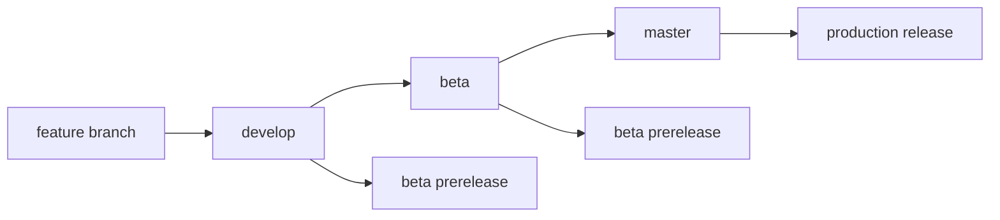

# Release Guide

## 🚀 自動リリースワークフロー

このプロジェクトは GitHub Actions を使用した自動リリースシステムを採用しています。

### 📦 リリースタイプ

#### 1. **本番リリース (Production Release)**
- **ブランチ**: `master`
- **トリガー**: `master` ブランチへのプッシュ
- **NPMタグ**: `latest`
- **バージョン**: セマンティックバージョニング

#### 2. **プレリリース (Prerelease)**
- **ブランチ**: `develop`, `beta`, `alpha`
- **トリガー**: 各ブランチへのプッシュ
- **NPMタグ**: `beta`, `alpha`
- **バージョン**: `x.x.x-beta.x`, `x.x.x-alpha.x`

### 🔄 リリースフロー



### 📋 必要な設定

#### GitHub Secrets

以下のシークレットをGitHubリポジトリに設定してください：

1. **`NPM_TOKEN`**
   ```bash
   # NPMトークンの作成
   npm login
   npm token create --type=automation
   ```

2. **`GITHUB_TOKEN`** (自動で利用可能)

#### NPM Organization

パッケージは `@react-native-live-context` スコープで公開されます：
- `@react-native-live-context/client`
- `@react-native-live-context/server`

### 🛠️ 手動リリース

#### 本番リリース

```bash
# 1. masterブランチに切り替え
git checkout master
git pull origin master

# 2. バージョンアップ
npm run version

# 3. 公開
npm run publish
```

#### プレリリース

```bash
# 1. developブランチに切り替え
git checkout develop
git pull origin develop

# 2. プレリリースバージョンアップ
npm run prerelease

# 3. 公開
npx lerna publish from-package --dist-tag beta
```

### 📝 コミットメッセージ規約

Conventional Commits を使用してください：

```bash
# 新機能
feat: add screenshot caching functionality

# バグ修正
fix: resolve WebSocket connection timeout

# 破壊的変更
feat!: change API interface for screenshot options

# その他
docs: update README with installation guide
chore: update dependencies
ci: add automated testing workflow
```

### 🏷️ バージョニング

セマンティックバージョニング (SemVer) を採用：

- **MAJOR** (`x.0.0`): 破壊的変更
- **MINOR** (`0.x.0`): 新機能追加（後方互換性あり）
- **PATCH** (`0.0.x`): バグ修正

### 📊 リリース状況確認

#### NPM パッケージ

```bash
# 最新バージョン確認
npm view @react-native-live-context/client version
npm view @react-native-live-context/server version

# 全バージョン確認
npm view @react-native-live-context/client versions --json
```

#### GitHub Releases

- [Releases ページ](https://github.com/your-org/react-native-live-context/releases)
- [Actions ページ](https://github.com/your-org/react-native-live-context/actions)

### 🚨 トラブルシューティング

#### リリースが失敗した場合

1. **NPMトークンの確認**
   ```bash
   npm whoami
   ```

2. **権限の確認**
   ```bash
   npm access list packages @react-native-live-context
   ```

3. **手動でのリリース**
   ```bash
   # ローカルでビルド
   npm run build
   
   # パッケージの確認
   npm pack packages/client
   npm pack packages/server
   
   # 手動公開
   cd packages/client && npm publish
   cd packages/server && npm publish
   ```

#### バージョンの巻き戻し

```bash
# 特定バージョンを非推奨にする
npm deprecate @react-native-live-context/client@1.0.0 "This version has critical bugs"

# 最新タグを変更
npm dist-tag add @react-native-live-context/client@0.9.0 latest
```

### 📈 リリース後のチェックリスト

- [ ] NPMで正しく公開されているか確認
- [ ] GitHub Releaseが作成されているか確認
- [ ] ドキュメントが最新版に更新されているか確認
- [ ] サンプルアプリが新バージョンで動作するか確認
- [ ] 依存関係の更新が必要な場合は通知

### 🔗 関連リンク

- [NPM Package - Client](https://www.npmjs.com/package/@react-native-live-context/client)
- [NPM Package - Server](https://www.npmjs.com/package/@react-native-live-context/server)
- [GitHub Actions Documentation](https://docs.github.com/en/actions)
- [Lerna Documentation](https://lerna.js.org/)
- [Conventional Commits](https://www.conventionalcommits.org/)